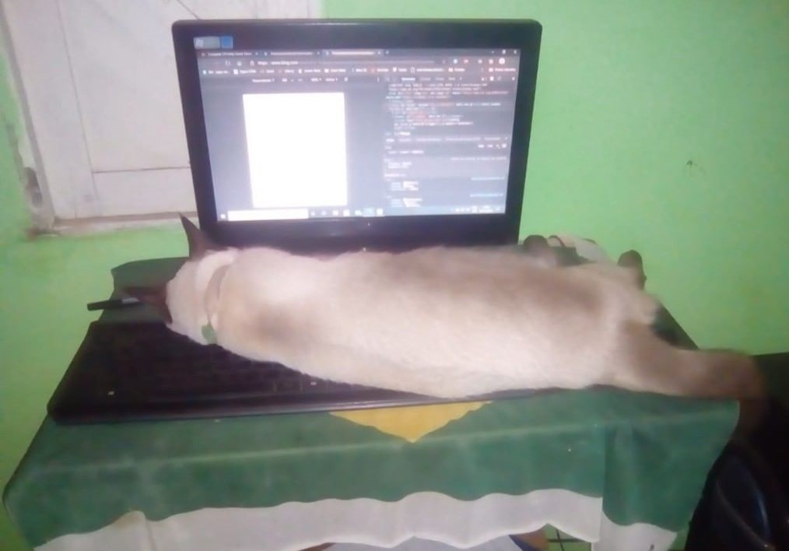

### Hi there, I'm Elexandro Torres 👋

### Welcome to my profile!!!

I'm a student of Bacharelors of Information of Tecnology at UFRN(Universidade Federal do Rio Grande do Norte)

I'm a Mobile developer and passionate of game developer.

- 🔭 I’m currently searching for a job as Mobile Developer Jr with Flutter.
- 🌱 I’m currently learning Flutter, and Android native developer. I'm also study english to improvement my comunication skills and i love to make games with Unity 3D.
- 💬 Fell Free to send me messages about work, tecnology or even to  talk about books, series, games and various other things.

📈 **My GitHub Stats:**

